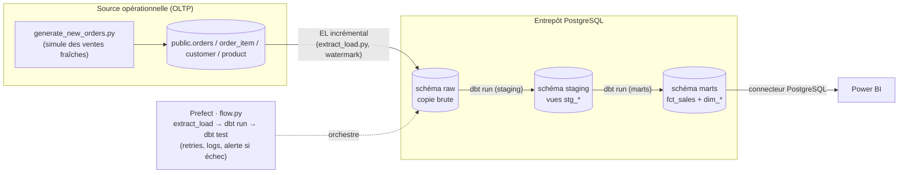

# Schéma du pipeline

## Les 3 couches (medallion simplifié)

| Couche | Contenu | Qui écrit | Règle |
|---|---|---|---|
| `raw` | Copie brute des tables sources | `extract_load.py` | on ne transforme **jamais** ici |
| `staging` | Nettoyée, typée, renommée (1 vue par source) | dbt (`stg_*`) | 1 modèle staging = 1 source |
| `marts` | Modèle en étoile (`fct_sales` + `dim_*`) | dbt | ce que consomme Power BI |

## Chargement incrémental (sans doublons)

- **Faits** : `extract_load.py` garde un *watermark* = `max(id)` déjà présent dans
  `raw.orders`, et ne charge que les commandes plus récentes. `ON CONFLICT DO NOTHING`
  protège des doublons.
- **Marts** : `fct_sales` est un modèle dbt **incrémental** (`unique_key =
  order_id + product_key`, stratégie `delete+insert`) → il n'ajoute que les
  nouvelles lignes à chaque exécution, sans recalculer l'historique.
- **Dimensions** : rechargées en entier (petit volume, plus simple et sûr).

## Orchestration & robustesse

- `flow.py` (Prefect) enchaîne **extract_load → dbt run → dbt test**.
- **Retries** par étape ; **logs** structurés ; une étape en échec fait échouer le
  flow (code de sortie non nul) → détectable par l'ordonnanceur pour **alerter**.
- **Tests dbt** (unicité des clés, not_null, intégrité référentielle) : le pipeline
  refuse de livrer des données incohérentes.

## Planification

Le flow est un simple script. Pour le rendre récurrent :
- **Windows** : Planificateur de tâches → action `python elt\flow.py` (ex. toutes les nuits).
- **Prefect** : `python elt/flow.py` peut devenir un *deployment* planifié
  (`flow.serve(cron="0 6 * * *")`) supervisé dans l'UI Prefect.
